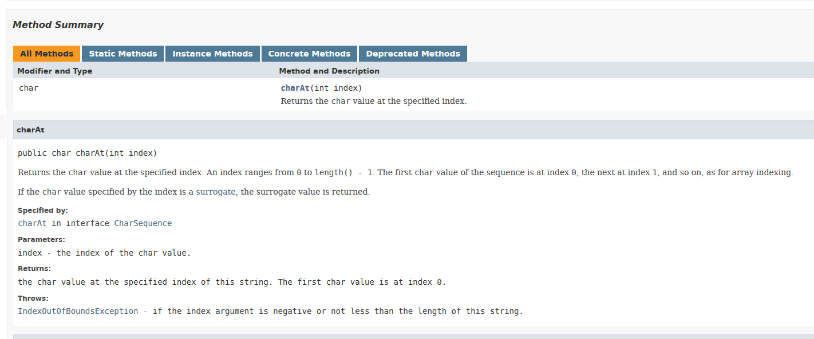

# How to write Java documentation
These are rules for writing documentation comments in Java, and are based on popular style guides (See [Sources](#sources) for more information).

Documentation comments are written for overview, package, class, interface, field, constructor, and method. And subsequently the term _API items_ will refer to these in general, unless mentioned otherwise.

> **Note**: The term _Documentation Comments_ is used to denote comments enclosed in `/** ... */` which are processed by the `javadoc` tool for generating API documentation.

---
## Overview
The following is an example of a typical documentation comment (refer to this example while reading the documentation):

```
/**
 * Returns an Image object that can then be painted on the screen. 
 * The url argument must specify an absolute {@link URL}. The name
 * argument is a specifier that is relative to the url argument.
 * 
 * <p>This method always returns immediately, whether or not the 
 * image exists. When this applet attempts to draw the image on
 * the screen, the data will be loaded. The graphics primitives 
 * that draw the image will incrementally paint on the screen. 
 *
 * @param  url  an absolute URL giving the base location of the image
 * @param  name the location of the image, relative to the url argument
 * @return      the image at the specified URL
 * @see         Image
 */
 public Image getImage(URL url, String name) {
        try {
            return getImage(new URL(url, name));
        } catch (MalformedURLException e) {
            return null;
        }
 }
```

Notice the following:

* The symbol `/**` marks the beginning of the documenation comments, with each subsequent line starting with an astrisk. The symbol `*/` marks the end of the documentation. 
    * The code is indented to aligh with the documentation.
* The documentation is divided into two sections - description section and the block tags section.

> **Tags:** Tags are predefined keywords prefixed with an `@` symbol and convey some special meaning to the `javadoc` tool. There are two types of tags - inline tags and block tags.
>
>* **Inline Tags:** These tags can appear anywhere in the documentation comments, in either section. These look like block tags enclosed between `{}` braces. These tags may also appear in between lines. For example, `{@link}`, `{@docRoot}` etc.
>
>* **Block Tags:** These tags define a block (think of it like a paragraph) of text. By convention these tags only appear in the block tags section. For example `@param`, `@see` etc.

The resulting HTML render of the above documentation comments is as follows:

<pre>
getImage
public Image getImage(URL url,
                      String name)
Returns an Image object that can then be painted on the screen. The url argument must specify an absolute URL. The name argument is a specifier that is relative to the url argument.

This method always returns immediately, whether or not the image exists. When this applet attempts to draw the image on the screen, the data will be loaded. The graphics primitives that draw the image will incrementally paint on the screen.

<b>Parameters:</b>
url - an absolute URL giving the base location of the image.
name - the location of the image, relative to the url argument.

<b>Returns:</b>
the image at the specified URL.

<b>See Also:</b>
Image
</pre>

---
## Description section
This is the first section of the documentation comments and follows the following rules:

* **First sentence**: the first sentence of this section should be a summary sentence, containing a concise but complete description of the API item. 
    * The first sentence is copied as-is to the index corresponding to the API item (class/interface, method, member, field or package).
    * The sentence ends at the first period followed by a space, tab, line terminator or block-tag. 
    But if for some reason a period does appear in between the sentence, you do the following:
        ```
        /**
         * This is a simulation of Prof.&nbsp;Knuth's MIX computer.
         */
        ```
        or

        ```
        /**
         * This is a simulation of Prof.<!-- --> Knuth's MIX computer.
         */
        ```
    * The image below demonstrates the point. It's the documentation for `charAt(int)` method of the String class.
        
    * Rules for framing this sentence:
        * **Methods**: should start with a verb - since methods describe/embodie an action
        * **Classes/Interfaces/Fields**: should state the object while omiting the subject - since these describe things (or more precisely objects)

* **Paragraphs**: One blank line—that is, a line containing only the aligned leading asterisk (*)—appears between paragraphs, and before the group of block tags if present. 
    * Each paragraph but the first has `<p>` immediately before the first word, with no space after.

* The description in general should be implementation independent. Don't inlcude platform specific details unless absolutely necessary, and mention while doing so. You may start an implementation specific description something like this:
        
        ```On <platform> ...```
        
        or 
        
        ```Implentation-specific: ...```

> **Inheriting Method Documentation:**
>
> Method comments are inherited (duplicated/copied) for a method that overrides or implements other methods in the following cases:
>    
>    * When a method in a class overrides a method in a superclass
>    * When a method in an interface overrides a method in a superinterface
>    * When a method in a class implements a method in an interface
>
>   When a method is overriding \(impementing\) another method, the `javadoc` tool will generate a subheading "Overrides" \("Specified by"\) with a link to the method it's overriding \(impmementing\).
>
>   If the method contains no documentation comments, the `javadoc` tool will simply copy the documentation of the method it's overriding or implementing. But if the method contains documentation then "Overriding" ("Specified by") subheading with the link will appear, and no documentation is copied.

* Add description beyond the API name. The description should convey something that is not already conveyed by the API name.
    
    > <code>Effort to avoid redundancy pays off in extra clarity</code> - someone

---
## Block-tags Section
* Block tags are listed in the following order, also mentioned are the API items they are used with:
    * `@author`
    * `@version`
    * `@param`
    * `@return`
    * `@throws` (replaces `@exception`) 
    * `@see`
    * `@since`
    * `@serial` (more specific forms `@serialField` & `@serialData`)
    * `@deprecated`

* One may separate groups of similar tags by blank lines for better visual formatting.

    > **Note:** A summary of where, how and when to used these tags is given in the following points. But for detailed information refer to the [this article](https://docs.oracle.com/javase/7/docs/technotes/tools/windows/javadoc.html#javadoctags).

* The following describes where, when and how to use these tags:
   
    * `@author` - used with class, interface, package & overview
        * Used for specifying the name(s) of contributing author(s)
        * **Ordering**: follow a chronological order with the original creator at the top.
   
    * `@version` - used with class, interface, package & overview
        * Holds the current version number of software that this code is part of.
   
    * `@param` - used with method & constructor

        * Used for describing a parameter.
        * **Ordering**: follows the same order as the parameters appear in the decleration.
        * Written in the following format: `@param <param-name> <description>`. Consider the following example:
            ```
            /**
             * @param string  the string to be converted
             * @param type    the type to convert the string to
             * @param <T>     the type of the element
             * @param <V>     the value of the element
             */
             <T, V extends T> V convert(String string, Class<T> type) {
                ...
             }
            ```
        * This tag (including the description) is mandatory, even if the parameter name is self-expalanatory. Just find someting more specific to write, and as the saying goes...
            > <code>Effort to avoid redundancy pays off in extra clarity</code> - someone
        * No dashes or puncutations before description, since `javadoc` introduces an hyphen while rendering the documentation
        * The first noun in the description should be the datatype of the parameter.
        * Start with a phrase and follow with a sentence if needed.
        * Begin the description with a lowercase letter if it's a phrase or uppercase letter if it's a sentence.
        * End the description with a "." only if another phrase/sentence follows it.
   
    * `@return` - used with method
        * Used for describing the value returned by a method.
        * Required for every method that has a non-`void` return type.
        * This description is mandatory, even if the method description makes it obvious. Just find someting more specific to write.
        * Use same capitalization and punctuation rules as with `@param`.
   
    * `@deprecated` - used with method

        * Only the first sentence of the description appears in the summary section & index.
            * This is placed infront of the method description in _italics_ with bold-faced "**Deprecated:**" as a prefix
        * The description should tell the user when the API was deprecated and what to use as a replacement, if any.
            * Use the `{@link}` inline-tag so specify the replacement.
            * Specify "No replacement", if replacement doesn't exist.

        >**Note**: for a more detailed explanation on when and how to use the `@deprecated` block-tag see [this article](https://docs.oracle.com/javase/7/docs/technotes/guides/javadoc/deprecation/deprecation.html).

    *  `@since` - used with all API items

        * Specifies the product version when the API item was first introduced (added/written in code).
        * **How to use:** 
            * When a package is introduced, specify an `@since` tag in its package description and each of its classes. 
                * In the absence of overriding tags, the value of the this tag applies to each of the class's members.
            * Do not specify this tag in the class's members. Add it only to the members added in a later version than the class. This minimizes the number of `@since` tags.
        * Increason the scope of a member (by chaging its access modifier) at a later release doesn't entail change in `@since`'s value, despite the increase in accessibility.
    
    * `@throws` (replaces `@exception`) - used with methods

        * Used to indicate which exceptions a programmer might want to catch and when they are thrown. It follows the format - `@throws <exception-class> <description>`.
        * **Ordering**: follow an alphabetical order according to the exception class name.
        * Always describe checked exceptions, and optionally unchecked exceptions that the caller might reasonably want to catch.
            * Speaking of unchecked exceptions, never describe a `NullPointerException`.
            > **Note**: The `throws` clause in a method decleration should only specify checked exceptions. Specifying unchecked exceptions is considered a bad programming practice.
        * Do not describe `Error` and its sub-classes, as they are unpredictable.
        * Never document an implementation-specific unchecked exception. 
            * For example documenting `ArrayOutOfBoundsException` is implementation specific (since an implemenatation need not always use arrays, but an alternate data structure). But a more appropriate exception to document would be `IndexOutOfBoundsException`.
        * **Caution**: Despite this documentation, a programmer should always assume that a method/constructor can throw unchecked exceptions that are undocumented.
    
    * `@see` - used with all API items
       
        * Used for inserting references to external resources. 
        * A documentation may contain any number of these tags. These are ordered roughly the way javadoc tool searches for non-fully qualified documentation links (see [this](https://docs.oracle.com/javase/7/docs/technotes/tools/solaris/javadoc.html#seesearchorder)).
        * Read [this article](https://docs.oracle.com/javase/7/docs/technotes/tools/solaris/javadoc.html#see) for a more detailed explanation.

> **Note**: Javadoc tags are used only to structure the human-readable documentation of a program and should never effect the program semantics.
    > * Java Annotations on the other hand are used to effect the way a piece of code is viewed by a tool/library like the compiler, which might effect the way it's run.

---
## Style Guide
### Code
* Enclose java keywords, names (for classes, interfaces, methods etc.) and code examples between `<code> ... </code>` tags.

* Use `@link` tags economically. Insert these tags only if you think the user might want to click and also only for first occurance of a link in the documentation comments.
    * Exclude links to `java.lang.*` packages - a user who doesn't know this shouldn't be writing code in Java.

* Omit paranthesis while writing general form of a method/constructor, like so
    ``` 
    Use the add method for adding items to the list.
    ```
    But while referring to a specific method/constructor implemenation (say overloaded methods or constructors), include the parameter types in the paranthesis like so
    ```
    Use the add(int) method for adding integers to the list.
    ```

* Use "this" instead of "the" or anything else while refering to an instance of the current class.

### Sentence
* It's okay to use phrases instead of full sentences in the interest of brevity. But make sure that the idea is conveyed.
    * Expecially in summary sentence (the first sentence) and with `@param` tag

* Write description in 3rd person.

* Don't use abbreviations like aka (also known as), e.g. (for example), i.e. (to be specific), viz. (namely or in other words) etc. Use their expanded forms instead.

---
## Package Level Documentation
* This is a very important piece of documentations: for it's the first place programmers go for documentation.

* This documentation should provide programmers with everything necessary to use the package.

* Package documentation comments are written in a file named `package-info.java` and placed in the correspoinding package's root directory (Each package has its own documentation file).
    >**Note**: There is also a `package.html` file used as an alternative to `package-info.java`. The former is for writing documentation using HTML tags while the latter allows us to write documentation like in any other `.java` file.

* Only contains the package decleration and its corresponding documentation comments, like so
    ```
    /**
     * Provides the classes necessary to create an  
     * applet and the classes an applet uses 
     * to communicate with its applet context.
     * <p>
     * The applet framework involves two entities:
     * the applet and the applet context.
     * An applet is an embeddable window (see the
     * {@link java.awt.Panel} class) with a few extra
     * methods that the applet context can use to 
     * initialize, start, and stop the applet.
     *
     * @since 1.0
     * @see java.awt
     */
     package java.lang.applet;
    ```

* The first sentence should be the summary of the package. It should state what the package contains and state its purpose.

* Include a description of or links to any package-wide specifications for this package that are not included in the rest of the javadoc-generated documentation.
    * For example, the java.awt package might describe how the general behavior in that package is allowed to vary from one operating system to another (Windows, Solaris, Mac).

* Describe logical groupings of classes and interfaces.

> **Note**: Visit this [link](./res/package-doc-template.md) for a template of package level documentation.

---
## Documentation source files
* The `javadoc` tool generates documentation from the following types of files:
    
    * Java source code files - `.java` files
    * Package comment files - `package-info.java` files
    * Overview comments file
    * Miscellaneous un-processed files

* **Overview Comments File**:

    * This contains the documentation for the entire API.

    * These comments are written in a file named `overview.html` and placed in the top level directory of the source tree.

        > **Note:** one may specify a different name for this file using the `-overview` javadoc CLI option but use of the default name is encouraged.

    * `@see` tags should have fully qualified names.

* **Miscellaneous Un-processed Files**:
    
    * These files are placed in a folder named `doc-files`, which can be placed in any of the package root directories.

    * All links to these files should be hard-coded.
        * Unlike `.java` files (includes source code and package-info files), the javadoc tool simply copies these files without processing them.

---
## See Also
### Documenting Anonymous Inner Classes:
* Documentation for these classes are ignored by the javadoc tool. The only way to document them is to include their documentation in that of it's closest outer class.
    * But make sure that the outer-class itself isn't ignored by the javadoc tool. Since, some poor programmers may write some higly nested (with many levels) classes - though in this case it's better to redesign and reimplement the code if possible.

### Example of Documentation Comments:
* This [links](./res/example-javadoc.md) to an example of documentation comments in practice.

---
## Sources <a id="sources"></a>
* [How to Write Doc Comments for the Javadoc Tool](https://www.oracle.com/technetwork/java/javase/documentation/index-137868.html) - Oracle Technology Network
* [Google Java Style Guide](https://google.github.io/styleguide/javaguide.html) - Github
